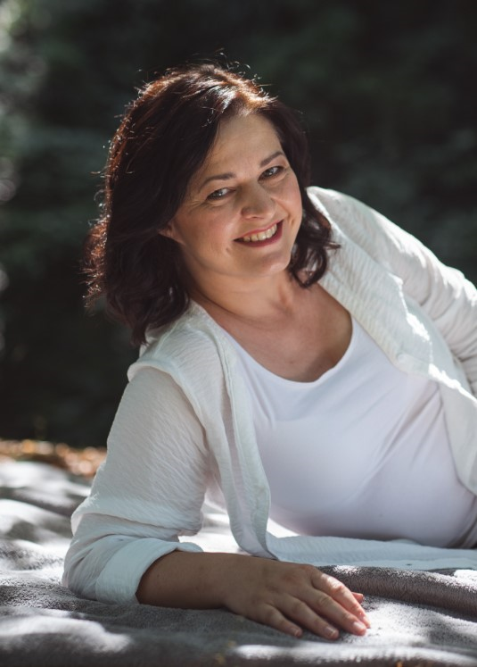
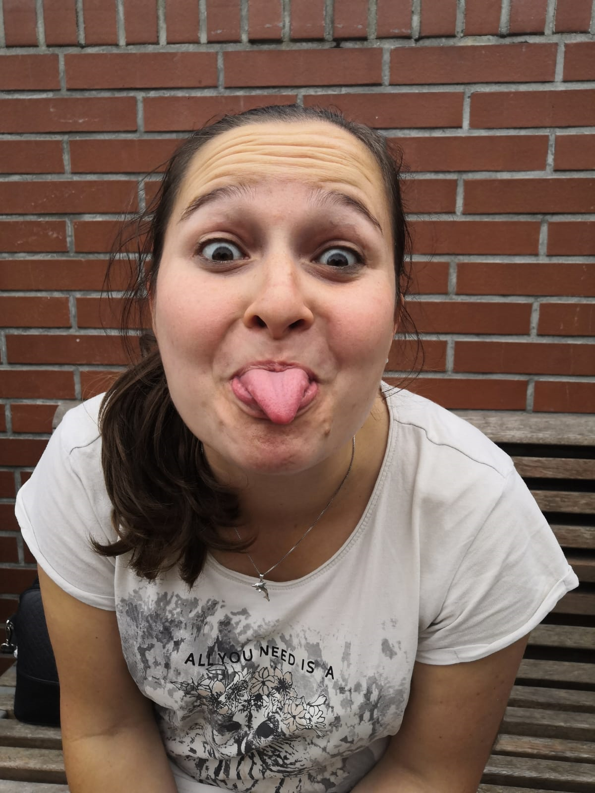
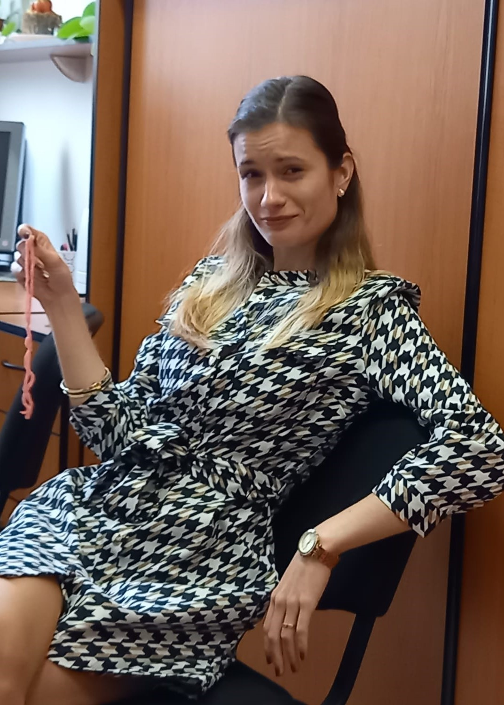

<link rel="stylesheet" href="styles.css" type="text/css">

Our team is changing a bit each year with new Master's and PhD students coming and leaving. However, we would like to introduce you to those who you will meet with 99% certainty or who will reply to your emails, tweets and love letters (please send us some!).  
 

&nbsp;

### Dr Klára Hulíková  
  

One of the founding members of the conference. Demography enthusiast and very popular teacher. 
She is keeping her eye on us and tries to calm down the most bonkers ideas we have.  

research interests: *formal demography, mortality, demography education*

&nbsp;

&nbsp;
  

&nbsp;
  

&nbsp;
  
### Dr Jitka Slabá  
  

The greatest demography freak in the team. Lively, (slightly) crazy, friendly and loud in times of silence. 
R promoter, goals setter, order giver and positive thinking advocate. 
She will certainly take you to the pub; the only thing to do is ask because she sometimes might feel overwhelmed when too many people around.  

research interest: *fertility, family planning*

Jitka on [twitter](https://twitter.com/sljitka).
 

&nbsp;

&nbsp;

### Anna Altová  
  

Split personality team member. Demographer and social epidemiologist by training who feels like both and neither all the time. 
You might find her running around stressed, trying to solve something which is not a problem at all or solving unsolvable without a single hesitation. 
She feels great on the stage and surrounded by people and forces others to do the same.   

research interests: *health, cancer epidmeiology*

Anna on [twitter](https://twitter.com/boruvka_a)

&nbsp;

&nbsp;

### Katka Brázová

The most positive member of the team. She will smile even when angry (which happens approximately once a year). 
She will do anything & everything she is asked for, even if we ask too much. 
If you persuade her to chat with you, you will love her instantly.  

research interests: *healthcare services availability, mortality*  

Katka on [twitter](https://twitter.com/Kacka_Mal)

&nbsp;
 

&nbsp;
 

&nbsp;
 

### Dr Bára Janáková  
  
  
The mum of the team. She always has all the finances and paperwork in order and tells us if we actually can do the crazy stuff we want to do. 
Positive mind, firm hand, calm soul. 
We love her and we would not be able to do anything without her.  

research interests: *historical demography*

&nbsp;
 

&nbsp;
 

&nbsp;
 

### Martin Vondrášek
    
 He will make the craziest ideas happen and he will do it with a smile on his face. He wants demography to be taught in high-schools and makes the best teaching materials (including the [population pyramid Christmas tree](https://www.natur.cuni.cz/geografie/demografie-a-geodemografie/pro-skoly/hratky-s-demografii/vanocni-stromek-z-vekove-pyramidy/vanocni-stromek-z-vekove-pyramidy-obrazkovy-navod/at_download/file)). And he's a singer!

research interests: *demography education*

&nbsp;
 

&nbsp;
 

&nbsp;
 

### Adéla Pola
    
Adéla was a bit forced into Young Demographers, but she secretly enjoys it. She the most gracious, calm and decent member of the group, probably because she is also a countess. She can be a bit shy, but she can also be a lot of fun. She handles everything from eating pad thai to complicated demographic modelling with grace most true to herself. 

research interests: *formal demography*

